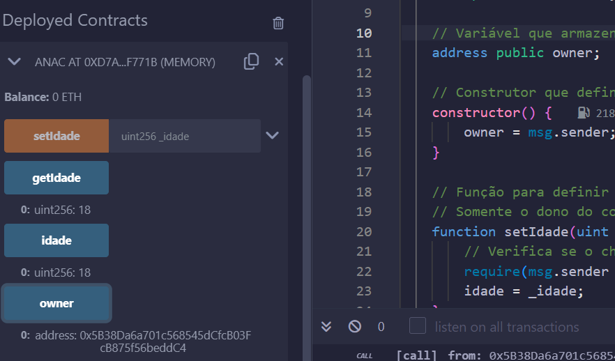
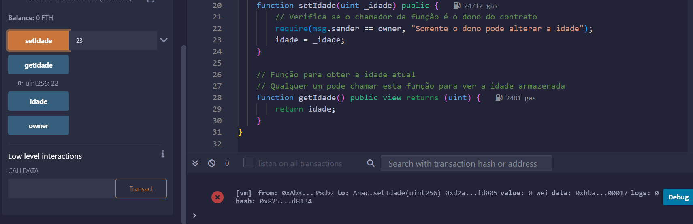
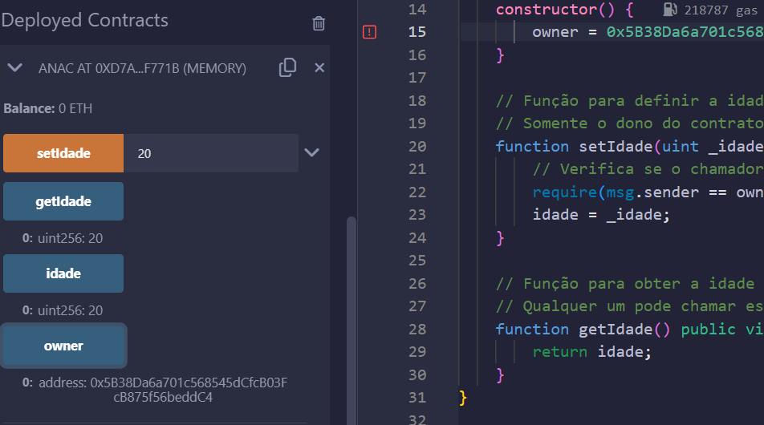

# Smart Contract for Managing Age

## **👤 Integrante:**

- [Izadora Luz](https://www.linkedin.com/in/izadoraluz-rsn/)

## **👨‍🏫 Professores:**

- [Renato Penha](https://www.linkedin.com/in/renato-penha/) - Professor orientador
- [Victor Hayashi](https://www.linkedin.com/in/vthayashi/) - Professor de programação

## **📝 Descrição**

Este projeto envolve a implementação de um contrato inteligente em Solidity para gerenciar a idade de uma pessoa. O contrato inclui funcionalidades para definir e obter a idade de uma pessoa, garantindo que apenas o proprietário do contrato possa modificar essa idade.

### Funcionalidades implementadas:

- **Variável de estado `idade`:** Representa a idade de uma pessoa, que por padrão é inicializada em 18 anos.
- **Função `setIdade`:** Permite que o proprietário do contrato defina a idade para um novo valor.
- **Função `getIdade`:** Retorna o valor atual da idade armazenada no contrato.
- **Controle de acesso:** Somente o proprietário do contrato pode alterar a idade, garantindo segurança e controle.

## **📁 Estrutura de pastas**

- `ContratoAnac/`
  - `contract_Anac.sol`: Contrato inteligente em Solidity para gerenciar a idade.
- `images/`: Pasta com as imagens dos testes
- `README.md`: Documentação do projeto.

## **💻 Tecnologias Utilizadas**

- **Solidity**: Linguagem de programação utilizada para desenvolver o contrato inteligente.
- **Remix IDE**: Ambiente de desenvolvimento integrado para compilar e implantar contratos inteligentes Solidity.

## **🧪 Casos de teste:**

Os casos de teste foram desenvolvidos para verificar o funcionamento correto do contrato inteligente de gerenciamento de idade.

1. **Testar a obtenção da idade padrão:**
   - **Descrição**: Após a implantação do contrato, ao chamar a função `getIdade`, deve-se retornar 18, confirmando que a idade padrão está corretamente configurada.
   
   

   Figura 1 - Visualização inicial da idade
   
   Fonte: Material produzido pelo autor (2024)
   

2. **Testar a modificação da idade por um não-dono:**
   - **Descrição**: Tentativa de chamar a função `setIdade` de um endereço que não é o dono do contrato. A modificação deve ser negada, preservando a integridade dos dados.

   

   Figura 2 - Tentativa de modificação por não-dono
   
   Fonte: Material produzido pelo autor (2024)
   

3. **Testar a modificação e obtenção da idade pelo dono:**
   - **Descrição**: O dono do contrato chama a função `setIdade` para mudar a idade para um novo valor, como 25. Em seguida, ao chamar `getIdade`, o contrato deve retornar o novo valor 25, confirmando que a modificação foi bem-sucedida.
   
   

   Figura 3 - Modificação de idade pelo dono
   
   Fonte: Material produzido pelo autor (2024)
   

