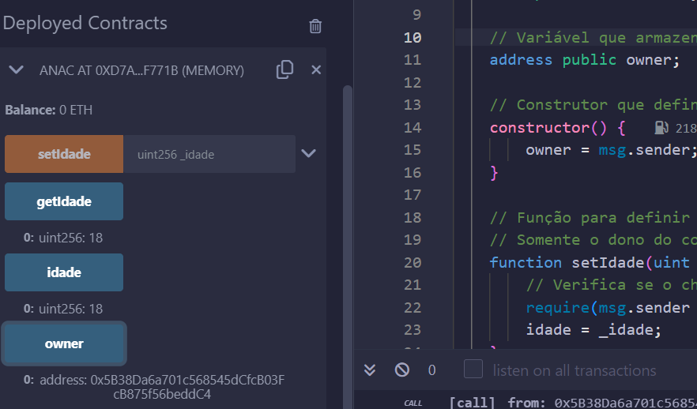
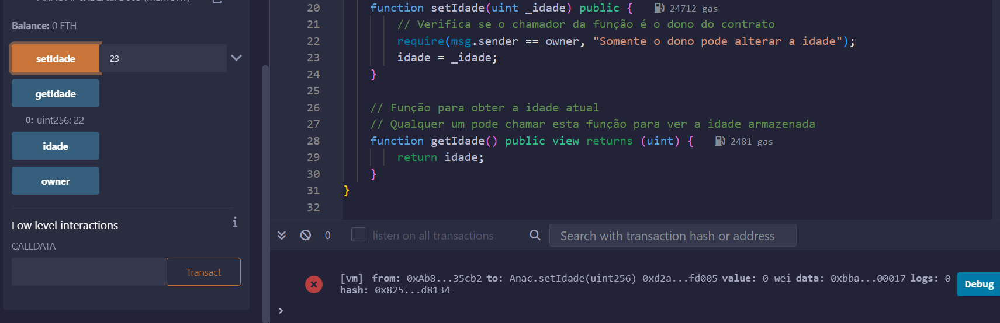
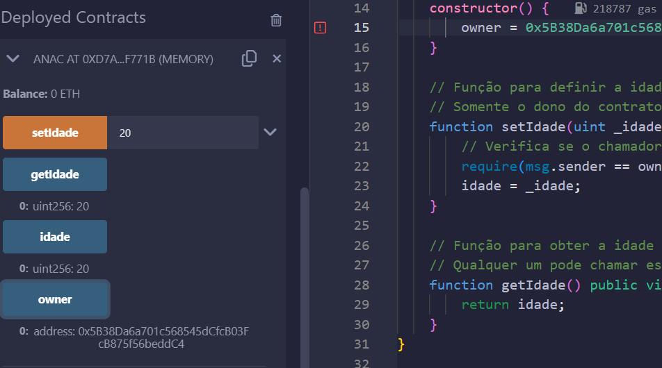

Casos de Teste
Casos de teste para testar este contrato:

Testar a obtenção da idade padrão: Ao implantar o contrato, a chamada à função getIdade deve retornar 18, confirmando que a idade padrão está corretamente configurada.

Testar a modificação da idade por um não-dono: Tente chamar setIdade de um endereço que não seja o dono do contrato.

Testar a modificação e obtenção da idade pelo dono: O dono do contrato chama setIdade para mudar a idade para um novo valor, por exemplo, 25. Em seguida, ao chamar getIdade, o contrato deve retornar o novo valor 25, confirmando que a modificação foi bem-sucedida.

